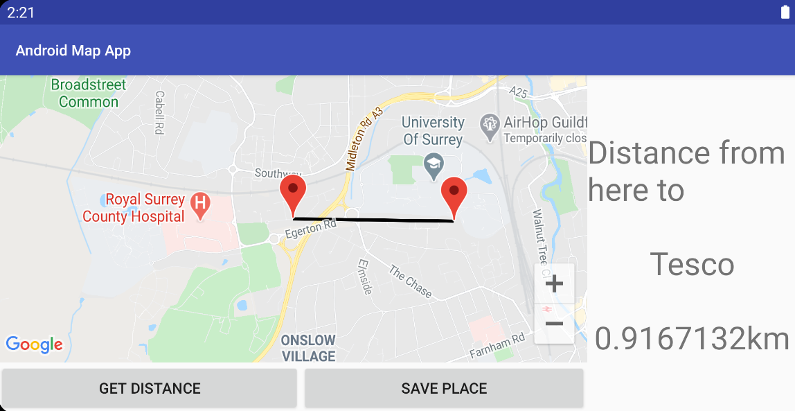

# Android Map App

This is an Android Application which let users to save destinations and get distances between the current location and the destinations.
It is implemented with Android Studio.

## User Interface

### Main View

First view when the application starts.  

  There are two textboxes for users to input the name and the address of the location.

The location will be added to the list once the user clicks ADD button.  

  The user can select a location from the dropdown.
The user can remove the location from the list by clicking REMOVE button.

The view changes to map view when the user clicks GO button.
  
### Map View

It show a map. The map can be zoomed in and out and panned.

When the user clicks the GO button on the main view, it displays a line between the current location and the location that the user selected.  

  The user can get the distance from the current location to the selected location by clicking the GET DISTANCE button.  

  The map and distance are displayed next to each other with landscape layout.  

  The destination point on the map can be dragged to different position.
The application will calculate the updated distination when the user click the GET DISTANCE button after the destination point changed.  

  The destination point can be saved by clicking SAVE PLACE button.
The saved destination point will be displayed when the user select the destination next time.

## Implementation

### Activities

There are three activities.

- MainActivity for adding and removing destinations.
- MapActivity for displaying a map.
- DistanceActivity for displaying the distance between current location and the selected destination.

### Layouts

This applciation supports portrait and landscape layouts.

There are two fragments. One is for a map and another one is for displaying a distance next to the map with landscape layout.

### Persistent state

The camera position and destination position are saved locally so it persists the state of the map across applications and activity instance transitions.

### Current location

There are two services for background tasks.
One is normal service which gets the last known location. Another one is intent service which updates the current location.

Two broadcast receivers are registered to receive results from the services.

This is for getting the current location if the application cannot get a recent location reading from the system.
Also, it allows the application to update the current location in background if the user moves.

The Criteria class was used to select the best provider which estimates current location more accurately.

### Database

Database is used for saving destinations in this application.

### Destinations

This application gets latitude and longitude from addresses using Geocoder.
AsyncTask is used to do this process in background.
